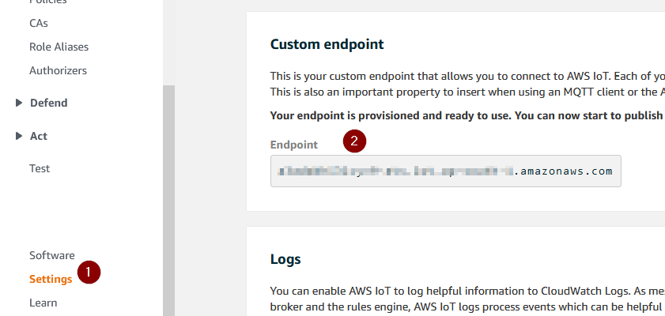

# Getting Started Guide: UART to Any Cloud Demo for Microchip PIC32MZW1 Curiosity/ WFI32E IOT Board.

Devices: **| PIC32MZW1 | WFI32 | Trust\&Go (ECC608) |**

## Introduction

This page describes the UART to Any Cloud Demo for the PIC32MZW1 Curiosity/ WFI32E IOT board.

## Features
1. Support of AT CMDs for configuring the Board via UART

2. Full TNG and security handling inside module, so very easy implementation on host

3. No need to recompile image for different cloud vendors (single image supports connectivity with AWS / Azure / test.mosquitto.org)

4. Mutual authentication supported with AWS and Azure

5. Server authentication supported for test.mosquitto.org

## Prerequisites

- PIC32MZW1 Curiosity Board kit

- Wi-Fi Access Point or mobile hotspot with Internet access

- Personal Computer

- USB-UART converter

***Note:*** Please use MPLABX 5.45 or higher with MHC 3.6.2 or higher to edit and regenerate the project 

## Hardware Setup

1.  Ensure that the credentials to the Wi-Fi AP with Internet access are handy

2.  Ensure that J202 jumper is connected to VBUS-VIN

3.  Connect host PC to the **_USB Power connector (J204)_** using a USB Type-A male to micro-B USB cable.

## Demo block diagram

## Application Overview

The demo code is written as a FreeRTOS based MPLAB Harmony3 application that leverages the system service-based architecture of PIC32MZ W1. The demo can connect to any of the three Clouds- AWS, Azure or test.mosquitto.org without the need for recompiling of the image.

## Running the Demo

Perform the following steps:

1.  Connect the Curiosity Board to your PC

2.  The device enumerates as a mass storage device (**_MSD_**).

3. All the configurations on the device will be done using AT Cmds via the UART. The details regarding the supported AT CMDs is given in [AT Command Reference Document](https://github.com/MicrochipTech/PIC32MZW1_AnyCloud/doc/ATCommandReference.docx)

4. Configure the home AP credentials using the AT Cmds
    
    Example:
    
        AT+WSTAC=1,"DEMO_AP"
        AT+WSTAC=2,3
        AT+WSTAC=3,"password"
        AT+WSTAC=4,255
        AT+WSTAC=12,"pool.ntp.org"
        AT+WSTAC=13,1
        AT+WSTA=1

4.  The device connects to the Wi-Fi and the IP address is assigned, and relevant AT Cmd response is sent to UART. 
    
    Example:

        +WSTALU:"42:2C:62:CC:C0:0B",11
        +WSTAAIP:"192.168.159.108"
        +TIME:2,3864185092

5.  Configure the device to connect to Cloud - in this case either of AWS or Azure or test.mosquitto.org

    Example:

        AT+MQTTC=1,"youramazonaws.com"
        AT+MQTTC=2,8883
        AT+MQTTC=3,"yourDeviceId"
        AT+MQTTCONN=1
    
    Note: One needs to register the device certificate with AWS and Azure portal in case the user wants to connect to either of these cloud vendors. Moer details in Appendix A and B

6. The device connects to the Cloud, and relevant AT Cmd response is sent to UART.

    Example:

        +MQTTCONNACK:0,0
        +MQTTCONN:1

## Secure Provisioning & Transport Layer Security

The PIC32MZW1 Curiosity Boards kits are shipped with the WFI32 module variants that include an on-board [Trust\&Go](https://www.microchip.com/design-centers/security-ics/trust-platform/trust-go) secure element. Since [Trust\&Go](https://www.microchip.com/design-centers/security-ics/trust-platform/trust-go) devices are pre-provisioned, the firmware can utilise the on-chip certificate to securely authenticate with AWS IoT Core/ Azure IoT Hub.

## Re-Flashing the device

In case you want to re-flash the device, perform the following steps:

1.	Download and install [MPLABX Integrated Programming Environment](https://www.microchip.com/mplab/mplab-integrated-programming-environment)
2.	Connect the power source selection jumper (J202) shunt in ‘PKOB-VIN’ position
3.	Connect the Curiosity Board’s debug USB (J302) to your PC.
4.	Open MPLABX IPE and select ‘PIC32MZ1025W104132’ device and ‘PKOB’ tool.
5.	Download the latest FW image (hex file) from the [releases](https://github.com/MicrochipTech/PIC32MZW1_AnyCloud/releases/latest) tab and load it into the IPE ‘hex file’ section.
6.	Click on the ‘connect’ and then the ‘program‘ buttons in the IPE and wait for device programming to complete.

## Appendix A: Connecting to AWS Cloud Instance

The demo lets you move the device connection between any of your cloud instances - AWS or Azure or test.mosquitto.org, without a firmware change. Perform the following steps to get the device connected to your own AWS cloud instance.

1.  Create an AWS account or log in to your existing AWS account.
    - Please refer to [Set up your AWS account](https://docs.aws.amazon.com/iot/latest/developerguide/setting-up.html) and [Create AWS IoT resources](https://docs.aws.amazon.com/iot/latest/developerguide/create-iot-resources.html) for details.

2.  Navigate to [IoT Core console](https://console.aws.amazon.com/iot/) \> Manage \> Things and click on “**_Create_**” / “**_Register a Thing_**”

3.  Select “**_Create a single thing_**”

4.  For thing name, you can have a unique name or the name that originates from the device certificate.

5.  Select defaults for the other fields and click “Next” at the bottom of the page.

6.  Select “**_Create thing without certificate_**” in the next page.

7.  Go to “**_Secure_**” \> “**_Policies_**” and select “**_Create a Policy_**”

8.  Create a new policy which allows all connected devices to perform all actions without restrictions

  > :x: &nbsp; **_Note_**: This policy grants unrestricted access for all iot operations, and is to be used only in a development environment. For non-dev environments, all devices in your fleet must have credentials with privileges that authorize intended actions only, which include (but not limited to) AWS IoT MQTT actions such as publishing messages or subscribing to topics with specific scope and context. The specific permission policies can vary for your use cases. Identify the permission policies that best meet your business and security requirements.Please refer to [sample policies](https://docs.aws.amazon.com/iot/latest/developerguide/example-iot-policies.html) and [security best practices](https://docs.aws.amazon.com/iot/latest/developerguide/security-best-practices.html)

| Item               | Policy Parameter |
| ------------------ | ---------------- |
| **_Name_**         | allowAll         |
| **_Action_**       | iot:\*           |
| **_Resource Arn_** | \*               |
| **_Effect_**       | Allow            |

9.  Navigate to **_Certificates_** \> **_Create a certificate_**

10. Select Create with “**_Get Started_**” under “**_Use my certificate_**”.

11. In the next screen, click “**_Next_**” without making any selections.

12. Click on “**_Select certificates_**”

13. In the MSD enumerated when the Curiosity Board is plugged in, you can find a “**_.cer_**” file with an alphanumeric name. Select this file when prompted to select a certificate.

14. Select “**_Activate all_**” and click “**_Register certificates_**”

15. Select the certificate and

    1.  Click **_Attach policy_** and select the “allowAll” policy we created

    2.  Click **_Attach thing_** and choose the *thing* we created

16. Navigate to “**_Settings_**” and copy the endpoint URL

17. Follow below guide to replace the AWS MQTT broker name with the endpoint URL in the OOB project to connect to your own AWS account:  
https://microchipsupport.force.com/s/article/Change-the-MQTT-broker-name-in-the-WFI32-OOB-project-to-connect-to-own-AWS-account

18. Program the updated code to the board, the device will connect to your own cloud instance.

## Appendix B: Connecting to Azure Cloud Instance

The demo lets you move the device connection between any of your cloud instances - AWS or Azure or test.mosquitto.org, without a firmware change. Perform the following steps to get the device connected to your own Azure cloud instance.

1.  Create an Azure account or log in to your existing Azure account.
2. Click on “Devices” in the left column

3. Click on “Add Device”

4. Create the device with relevant configuration

5. The Device ID is the id that is given as “Issued To” when you open the device certificate. 

      If one double clicks on the device certificate, one can see the Device Id:

      In the MSD enumerated when the Curiosity Board is plugged in, you can find a “.cer” file with an alphanumeric name. Select this file when prompted to select a certificate.      

6. Authentication type needs to “X.509 Self-Signed”

7. Primary and Secondary Thumbprints will be same, and one can generate it by using the following openssl command:

        “openssl x509 -in device1.crt -noout -fingerprint”
      
    Note: The thumbprint generated by the above command contains ‘:’ which need to be removed before setting the thumbprint in the Azure Portal

8. “Connect this device to an IoT hub” should be ‘Enable’

9. Click of 'Save'

10. The device would have been added to the Azure portal after this and it can be found in the list of devices displayed after clicking on the “Devices” in the left column of the web page.

