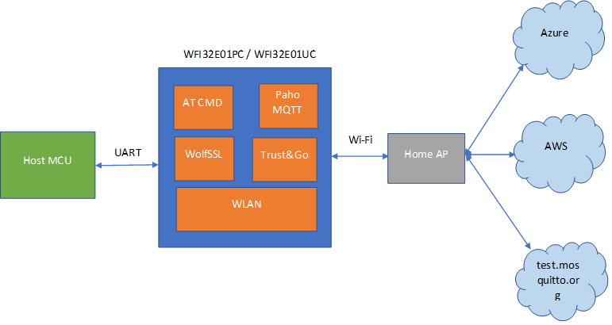

# Getting Started Guide: UART to Any Cloud Solution for Microchip PIC32MZ-W1 Curiosity/ WFI32E IOT Board.

Devices: **| PIC32MZ-W1 | WFI32 | Trust\&Go (ECC608) |**

## Introduction

⚠ Disclaimer
THE SOFTWARE ARE PROVIDED "AS IS" AND GIVE A PATH FOR SELF-SUPPORT AND SELF-MAINTENANCE. This repository contains example code intended to help accelerate client product development.

For additional Microchip repos, see: https://github.com/Microchip-MPLAB-Harmony

Checkout the [Technical support](https://microchipsupport.force.com/s/) portal to access our knowledge base, community forums or submit support ticket requests.   

Client are often challenged by fast and easy onboarding of Wifi product and to a given cloud. Microchip aims to make all these steps easy for the customer. This Solution allows easy connectivity to AWS, Azure and test.mosquitto.org with PIC32MZ-W1 Curiosity/ WFI32E IOT board, a powerfull MCU enabling the customer to create smart, connected and secure IoT solutions (Please visit [www.microchip.com/wfi32](www.microchip.com/wfi32) for more information including application notes, certifications, etc). Examples are provided in the github for PIC32MZ-W1 with Terminal over UART which can easily be used by replacing the terminal with 8/16/32-bit MCUs.

This page describes the UART to Any Cloud Solution for the PIC32MZ-W1 Curiosity/ WFI32E IOT board.

## Features
1. Easy to learn ASCII AT commands for adding Wi-Fi and Cloud connectivity to any processor

2. Mutual authentication supported with AWS and Azure

3. Server authentication supported for test.mosquitto.org

4. Designed for WFI3E01PC and WFI32E01UC modules with integrated [Trust\&Go](https://www.microchip.com/design-centers/security-ics/trust-platform/trust-go) (TNG)

5. Single pre-built hex file supports all features for majority of use cases. No need to recompile image for different cloud vendors (single image supports connectivity with AWS / Azure / test.mosquitto.org)

6. Complete source to enable customization when required

7. Supports MQTT, Socket programming(TCP/ UDP), SNTP, TLS (v1.3/ v1.2), ICMP, IGMP, DNS, DHCP

8. Features like OTA, Wi-Fi Provisioning, Low Power, Trust Flex, IPv6, mDNS planned for future releases.

## Hardware Setup

### Hardware Requirements
- [PIC32MZ-W1 Curiosity](https://www.microchip.com/en-us/development-tool/EV12F11A) or [WFI32-IoT board](https://www.microchip.com/en-us/development-tool/EV36W50A)
- Access Point with Internet

### Software Requirements
- [MPLAB X IDE](https://www.microchip.com/en-us/development-tools-tools-and-software/mplab-x-ide) (v6.0 or later)
- [MPLAB XC32](https://www.microchip.com/en-us/development-tools-tools-and-software/mplab-xc-compilers) (v3.01 or later)
- [MPLAB Harmony 3](https://www.microchip.com/en-us/development-tools-tools-and-software/embedded-software-center/mplab-harmony-v3)

	- Note: The project was developed and tested using the MPLAB X v6.0, and MPLAB XC32 v3.01. Also, the above tools are not required when the solution’s pre-built hex file is used.

## Solution block diagram

## Solution Overview

The Solution code is written as a FreeRTOS based MPLAB Harmony3 solution that leverages the system service-based architecture of PIC32MZ W1. The Solution can connect to any of the three Clouds- AWS, Azure or test.mosquitto.org without the need for recompiling of the image.

## Re-Flashing the device

In case you want to re-flash the device, perform the following steps:

1.	Download and install [MPLABX Integrated Programming Environment](https://www.microchip.com/mplab/mplab-integrated-programming-environment)
2.	Connect the power source selection jumper (J202) shunt in ‘PKOB-VIN’ position
3.	Connect the Curiosity Board’s debug USB (J302) to your PC.
4.	Open MPLABX IPE and select ‘PIC32MZ1025W104132’ device and ‘PKOB’ tool.
5.	Download the latest FW image (hex file) from the [releases](https://github.com/MicrochipTech/PIC32MZW1_AnyCloud/releases/latest) tab and load it into the IPE ‘hex file’ section.
6.	Click on the ‘connect’ and then the ‘program‘ buttons in the IPE and wait for device programming to complete.

## Evaluating the Solution

Perform the following steps:

1.  Connect the PIC32MZ-W1 Curiosity/ WFI32E IOT board to your PC

2.  The device enumerates as a mass storage device (**_MSD_**). This feature is currently used for reading the device certificate which is needed for registering with the cloud vendor. 

    **_Note:_** This feature will be removed when AT Command support for reading the device certificate is introduced.

3. All the configurations on the device will be done using AT Cmds via the UART. The details regarding the supported AT CMDs can be found in the document [ATCommandReference.pdf](https://github.com/MicrochipTech/PIC32MZW1_AnyCloud/blob/main/doc/ATCommandReference.pdf) in the "doc" folder

4. Configure the home AP credentials using the AT Cmds
    
    Example:
    
        AT+WSTAC=1,"DEMO_AP"
        AT+WSTAC=2,3
        AT+WSTAC=3,"password"
        AT+WSTAC=4,255
        AT+WSTAC=12,"pool.ntp.org"
        AT+WSTAC=13,1
        AT+WSTA=1

4.  The device connects to the Wi-Fi and the IP address is assigned, and relevant AT Cmd response is sent to UART. 
    
    Example:

        +WSTALU:"42:2C:62:CC:C0:0B",11
        +WSTAAIP:"192.168.159.108"
        +TIME:2,3864185092

5.  Configure the device to connect to Cloud - in this case either of AWS or Azure or test.mosquitto.org

    Example:

        AT+MQTTC=1,"youramazonaws.com"
        AT+MQTTC=2,8883
        AT+MQTTC=3,"yourDeviceId"
        AT+MQTTCONN=1
    
    Note: One needs to register the device certificate with AWS and Azure portal in case the user wants to connect to either of these cloud vendors. More details in [Cloud Setup Procedure](https://github.com/MicrochipTech/PIC32MZW1_AnyCloud/blob/main/doc/CloudSetupProcedure.pdf) document.

6. The device connects to the Cloud, and relevant AT Cmd response is sent to UART.

    Example:

        +MQTTCONNACK:0,0
        +MQTTCONN:1

## Secure Provisioning & Transport Layer Security

The PIC32MZ-W1 Curiosity Boards kits are shipped with the WFI32 module variants that include an on-board [Trust\&Go](https://www.microchip.com/design-centers/security-ics/trust-platform/trust-go) secure element. Since [Trust\&Go](https://www.microchip.com/design-centers/security-ics/trust-platform/trust-go) devices are pre-provisioned, the customer does not need to programe the device certificate for each of his devices and the firmware can utilise the on-chip certificate to securely authenticate with AWS IoT Core/ Azure IoT Hub.

